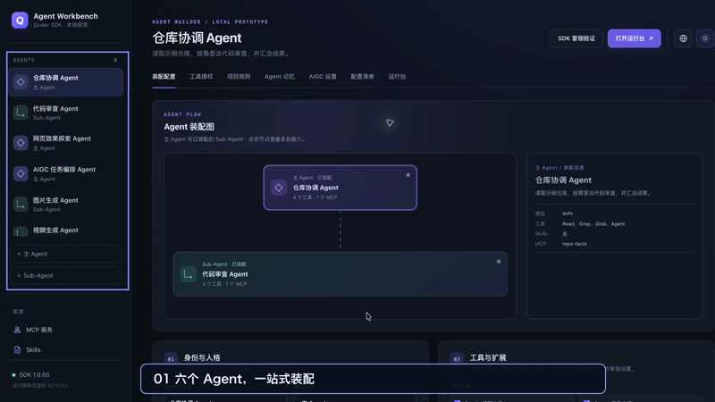
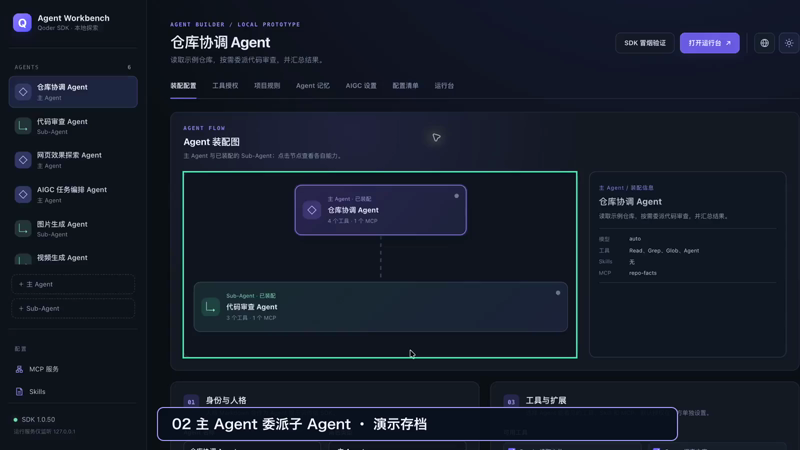
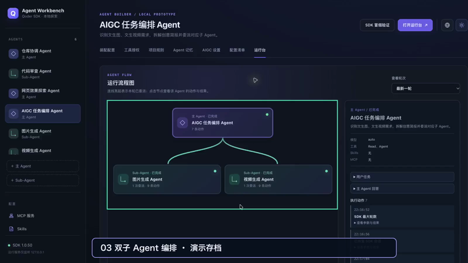
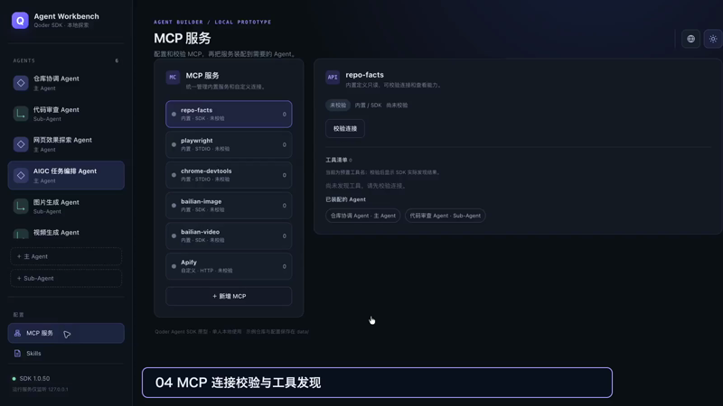
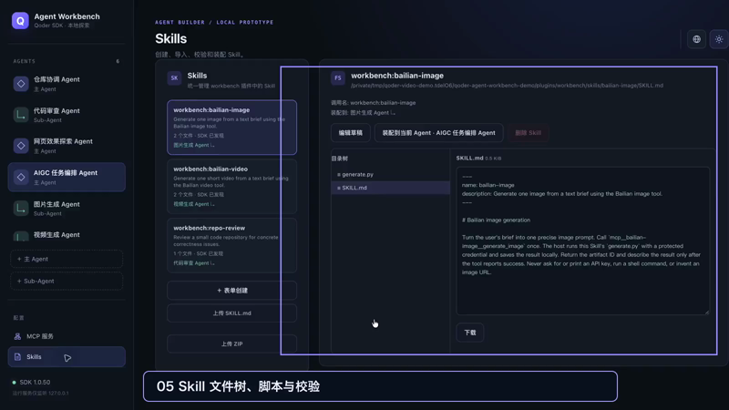
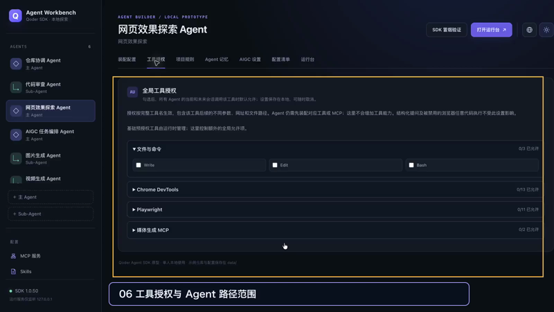

# Agent Workbench 浏览器演示短片

六段视频均录自 **Google Chrome 中运行的工作台页面**，画面只保留页面内容。原始操作由 Computer Use 驱动，成片剪掉等待时间并约以 **1.5 倍速**播放；每段不超过 20 秒，1600 × 900、24 fps、无音频。高亮框和片头文字已直接烘焙在 MP4 中。

| 主题 | 时长 | 视频 |
| --- | ---: | --- |
| 六个 Agent 与装配概览 | 13.3 秒 |  |
| 主 Agent 委派代码审查子 Agent | 12.7 秒 |  |
| 图片、视频双子 Agent 与历史产物 | 16.0 秒 |  |
| MCP 连接校验与工具发现 | 16.7 秒 |  |
| Skill 文件树、脚本与格式校验 | 18.7 秒 |  |
| 全局工具授权与 Agent 路径范围 | 17.3 秒 |  |

主子 Agent 与媒体片段使用**只读演示存档**中的真实历史事件和已生成文件。第 3 段的双子 Agent 流程与后半段图片／视频预览来自**不同成功会话**，画面已标注；本次拍摄没有重新调用百炼生成。MCP 连接检查、Skill 草稿校验及权限设置画面是在隔离的公开演示包中操作。视频未录入原作者的 Key、Token、Chrome 标签栏、书签或浏览器账号信息。

可直接下载 MP4 用于项目介绍。封面 PNG 与视频同名，方便在 GitHub README、文章或演示文稿中引用。
