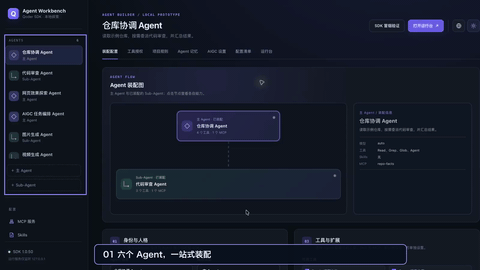
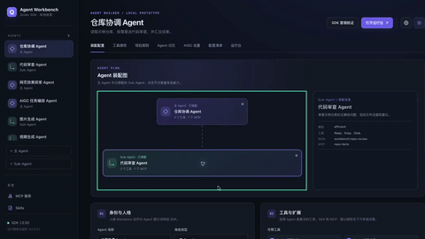
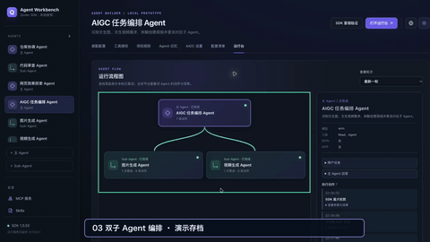
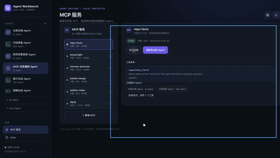
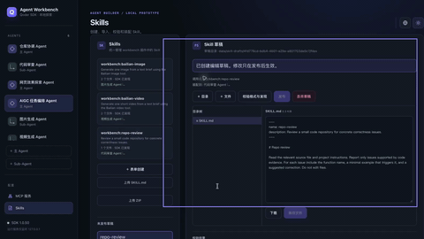
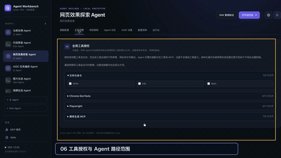

# Agent Workbench 功能演示

[进入滚动播放展示页](https://yiqi19940531.github.io/qoder-sdk-agentStudio/)

| 功能 | 展示内容 | 预览与视频 |
| --- | --- | --- |
| Agent 装配 | 浏览六个 Agent，查看主、子 Agent 的模型、工具、Skill 和 MCP 组合。 |  |
| 主子 Agent 委派 | 在流程图中查看主 Agent 委派代码审查子 Agent，以及双方执行动作。 |  |
| 图片与视频协作 | 查看编排 Agent 分配图片、视频任务，并回看生成产物示例。 |  |
| MCP 服务 | 校验连接、查看发现的工具，并了解 MCP 如何装配给 Agent。 |  |
| Skill 管理 | 查看 Skill 的目录和脚本，编辑草稿并校验 SDK 发现结果。 |  |
| 权限控制 | 查看全局工具授权、Agent 默认审批和本地路径范围。 |  |

图片／视频协作片段的流程与后半段产物预览来自不同的成功演示会话，画面中已标明。
