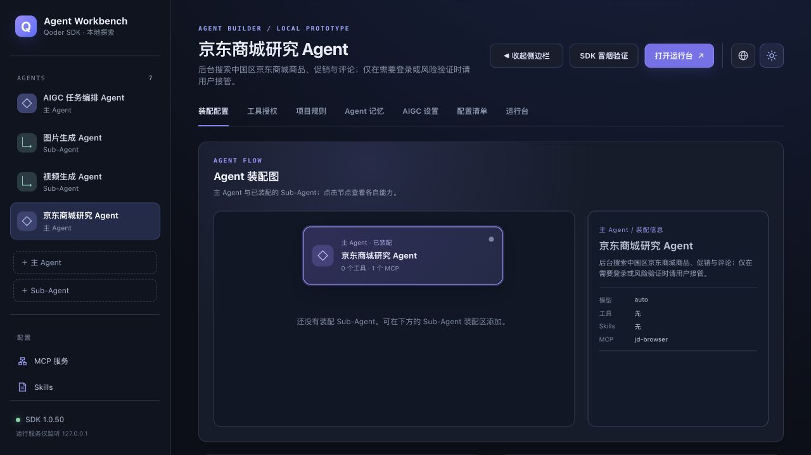
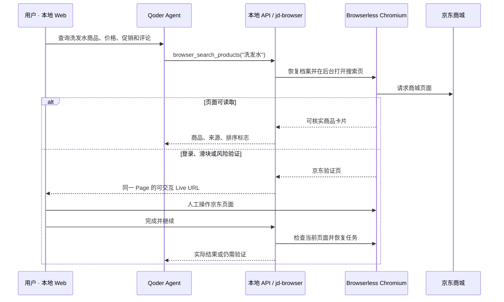
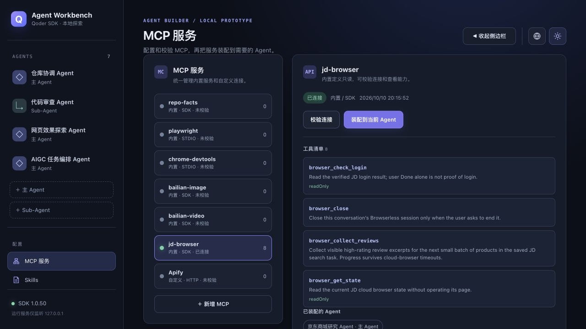
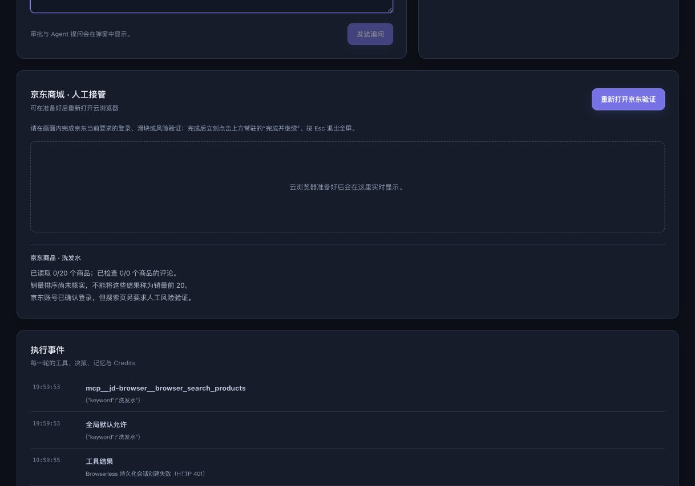
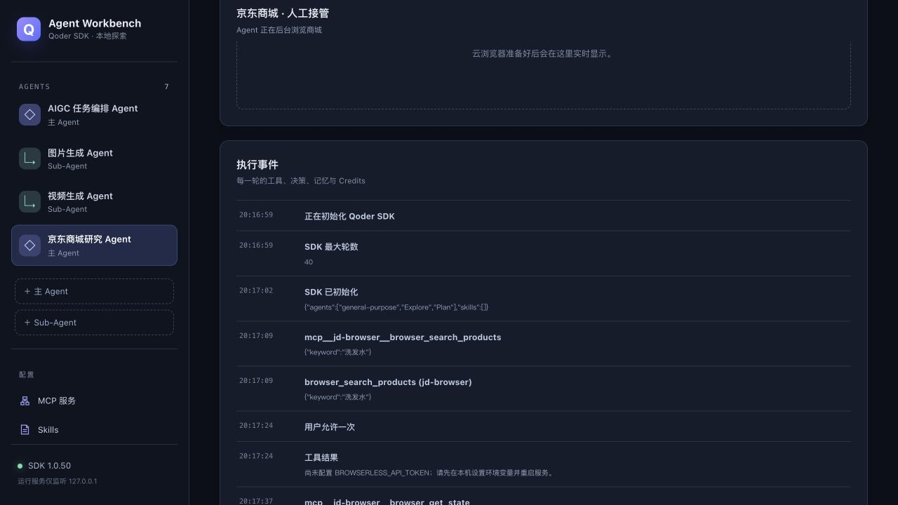

# 案例：京东洗发水检索与远程浏览器人工接管

> 案例状态：**登录档案恢复已实测；京东搜索触发额外验证；真实商品、促销和评论尚未采集成功。**本文记录已运行的效果和实现方法，不把未取得的数据写成结果。

## 1. 场景与价值

用户希望查询中国区京东商城的洗发水商品，尝试按页面“销量”排序，整理前 20 个**可核实的商品**的名称、品牌、价格、促销及页面可见的高评分评论。部分页面需要登录或风险验证。单纯让 Agent 在自己的浏览器中操作，用户无法接过同一页面完成滑块或短信验证；让用户在另一台浏览器登录，又不能把认证状态直接交给 Agent。

本案例将浏览器放在 Browserless 云端。Qoder Agent SDK 通过 `jd-browser` MCP 控制该浏览器；本地 Web 运行台只在需要人工操作时展示**同一浏览器会话**的可交互画面。用户在画面内完成京东要求的步骤后，Agent 从同一会话继续检查页面、保存进度。浏览器会话结束时，Browserless 认证档案可在新的云浏览器中恢复，避免每一步都从空白登录状态开始。

*图 1：公开演示工程中，京东商城研究 Agent 装配了 `jd-browser`，默认模型为 `auto`。截图来自未加载私人会话的公开工程。*

## 2. 技术结构

| 层次 | 主要实现 | 职责 |
| --- | --- | --- |
| 任务入口 | React 运行台、Qoder Agent SDK | 接收“洗发水前 20”等自然语言任务，记录多轮会话、工具调用和事件。 |
| 浏览器工具 | `server/runtime.ts` 中的 `jd-browser` SDK MCP | 向 Agent 提供搜索、评论、状态读取、人工交接和关闭等受控工具。 |
| 会话编排 | `server/browser-service.ts` | 维护会话状态、同一 Page 的自动／人工控制权、Live URL、连接续接和任务恢复。 |
| 页面判定 | `server/jd-login.ts`、`server/jd-shop.ts` | 区分商城首页登录证据、搜索页风险验证、实际商品卡片与可见评论。 |
| 云端浏览器 | Browserless Chromium、`puppeteer-core` CDP | 执行浏览器操作；人工阶段生成 Interactive Live View 供 Web iframe 操作。 |
| 私有状态 | `server/jd-profile.ts`、本机 `data/jd-tasks/` | 云端保存认证档案；本机只保存不含 Cookie 值的随机档案名及商品任务断点。 |

这里的“远程”指浏览器运行在 Browserless，Agent 服务与 Web 前端目前仍可同时运行在本机。将来 Agent 服务迁到远程机器时，只要本地 Web 能访问服务的受控 API 和 Browserless Live URL，这套交接关系仍然成立；本案例**没有声称已完成跨机器部署测试**。普通 Playwright／Chrome DevTools MCP 会建立独立浏览器，不能直接共享这个京东会话。

## 3. Agent 的执行方法

可复现的任务示例：

> 在后台搜索中国区京东商城的洗发水，尝试选择页面“销量”排序，列出前 20 个可核实商品的名称、品牌、价格和促销，并分批整理商品页可见的高评分评论。只有页面实际要求登录、滑块或风险验证时才把同一云浏览器交给我。无法读取或无法确认的字段请明确标注。

1. **后台优先。**`browser_search_products` 先加载保存的档案并访问 `search.jd.com`。正常页面不创建 Live URL，也不让用户提前登录。
2. **以网页证据为准。**工具尝试选择页面的“销量”排序，最多读取 20 个商品卡片；每项保留商品链接和页面可见字段。`sortApplied=false` 时不能宣称“销量前 20”，20 个商品也不等于 20 个品牌。
3. **遇关卡才交接。**搜索或评论页跳到京东登录／风险域名时，任务变成 `needs-human`。`browser_handoff` 为**当前云浏览器页面**生成可交互 Live URL；Agent 停止操作，防止与用户抢夺鼠标或导航。
4. **人工操作后重新判定。**“完成并继续”只表示用户交还控制权。服务还要检查当前页面、京东认证 Cookie 的**名称是否成对出现**以及登录表单／账户控件等布尔信号，不读取或回传 Cookie 值、手机号或验证码。用户手动完成滑块；系统不自动识别或绕过验证。
5. **保存状态与断点。**首次登录后调用 Browserless `saveProfile`，关闭原浏览器，再在新浏览器加载档案核验。商品任务的 `keyword`、`sortApplied`、已读商品及评论进度写入本机私有任务文件。新浏览器能确认商城登录，也不代表京东搜索页一定放行；两项分别记录。
6. **继续采集。**页面允许访问后，Agent 按批次调用 `browser_collect_reviews`。只引用当前商品页可见的高评分评论，互动数仅用于在可见内容中挑选片段，不能称为全站“最热”。

*图 2：`jd-browser` 是进程内 SDK MCP。工具发现可在配置页核对；只读状态工具与会操作页面的工具分开。连接校验本身不登录京东。*

## 4. 状态、权限和安全边界

浏览器会话按照 `CREATED → AI_RUNNING → HUMAN_CONTROL → VERIFYING → COMPLETED` 流转；连接续接时短暂进入 `RECONNECTING`。失败可能进入 `UNVERIFIED`、`EXPIRED` 或 `FAILED`。人工接管与核验期间，Agent 不能同时操作或关闭当前浏览器。

实现中特别区分三个结论：

| 结论 | 代表什么 | 不代表什么 |
| --- | --- | --- |
| 此前确认登录 | 保存档案曾在新浏览器的京东商城首页通过核验 | 当前搜索页已经放行 |
| 当前页需要验证 | 京东搜索／评论页显示登录表单、滑块或风险页 | 保存档案必然丢失 |
| 云服务不可用 | Browserless 会话断开、超时或账户额度不足 | 京东账号被判定退出 |

`BROWSERLESS_API_TOKEN` 只放在本机 `.env`，由服务端读取；前端拿到的是临时 Live URL，不能获得 Token。Live URL 是可控制浏览器的临时能力链接，不能写入公开日志或文档。认证状态保存在使用者自己的 Browserless 账号中，本机仅保存随机档案名；`.env`、`data/jd-browser-profile.json`、`data/jd-tasks/` 和私人新会话均被公开打包流程排除。浏览器工具只在 Agent 装配后可见，调用仍受工作台的工具审批与本机访问规则约束。

## 5. 本次运行记录

2026 年 10 月 10 日的真人操作中，服务先在新的 Browserless 浏览器加载保存的京东档案，并于 `www.jd.com` 确认登录。随后搜索“洗发水”时，京东将页面导向 `cfe.m.jd.com` 风险验证及 `passport.jd.com` 登录页。工具将任务保留为 `needs-human`，已读取商品 **0/20**，销量排序未确认，促销和评论也没有可引用结果。连接续接后来失败；Browserless 返回的额度响应表明免费套餐单位用量已达上限。已修正程序对“此前登录”“当前搜索验证”和“额度不足”的状态区分。

*图 3：实际会话的任务面板节选。它显示搜索停在人工验证关卡，商品数为 0；截图只保留非敏感的状态和任务统计，不展示账号、验证码或 Live URL。*

这次记录证明了**认证档案可以恢复并确认商城首页登录**，也证明了**京东搜索可能单独要求再次验证**。它尚不能证明销量前 20、促销或评论采集成功。Browserless 免费套餐对连接时长和单位用量有限制；增加本机超时时间或反复刷新 Live URL 不会绕过服务端限制。实现使用 Browserless 的[认证档案](https://docs.browserless.io/baas/features/authenticated-profiles)和[持久化会话](https://docs.browserless.io/baas/session-management/persisting-state)能力，具体可用时长与额度以使用者账户为准。

另在**不含 Browserless Token 的公开工程副本**运行同一类洗发水任务：Qoder Agent 实际调用 `browser_search_products`，工具明确返回缺少 `BROWSERLESS_API_TOKEN`；Agent 核对没有云浏览器会话后停止，没有打开京东登录页，也没有生成商品数据。这验证了未配置可选服务时的安全失败路径，不能代替真实云端采集。

*图 4：公开副本的实际运行事件。工具调用和“未配置 Token”的结果可见；没有包含 Token 值或个人账号。*

## 6. 如何在自己的环境重现

1. 按仓库[快速指南](../../QUICKSTART.zh-CN.md)启动工作台，并在本机 `.env` 填入**自己的** `BROWSERLESS_API_TOKEN`。中国区商城默认使用中国住宅出口，可能消耗额外 Browserless 单位。
2. 选择“京东商城研究 Agent”，确认它装配了 `jd-browser`。在 MCP 页面“校验连接”可发现工具；这一步无需京东登录。
3. 新建对话，使用第 3 节任务示例。遇到人工关卡时，在运行台的嵌入浏览器里完成京东要求的操作，再点击“完成并继续”。
4. 查看页面中的商品表、任务状态与排序标志，并核对每个商品链接。若仍为 `needs-human` 或商品数为 0，记录真实障碍，不补造结果。若出现免费额度提示，待 Browserless 账户有可用单位后再试；不要删除已保存的档案。

无需 Browserless Token 时，可在公开工程中查看 Agent 装配与 MCP 定义，并运行 `npm run test:browser` 验证模拟 CDP 流程；它不访问京东，也不能代替实站验收。构建细节见[第 13 阶段构建说明](../rebuild/13-jd-mall-research.md)，时间顺序与验证边界见[发布验证记录](../../VALIDATION.md)。
